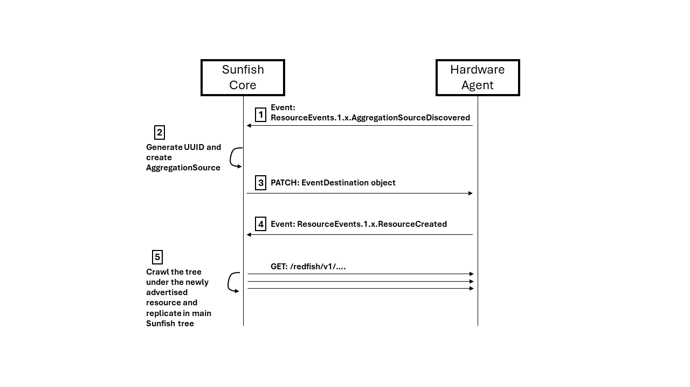

# Sunfish OpenFabrics Management Framework for Composable Disaggregated Infrastructures <!-- omit from toc -->

Version 0.0.1

**ABSTRACT:** Sunfish is designed for managing composable disaggregated resources over multiple fabrics using a central repository and an open-source API and toolset. Sunfish is designed for manipulating connected hardware resources using client-friendly RESTful abstractions and configuring fabric interconnects so that datacenter and AI workloads can be linked with available resources over dynamic fabric infrastructures. 

The Sunfish OpenFabrics Management Framework API defines a RESTful interface and a standardized data model to provide data structures to help simplify the development of composable distributed, disaggregated, computer architectures. Sunfish contains abstract data structures that represent computer system resources, available network fabric components and management, current resource operational conditions, and abstracted representations of composed disaggregated computing systems.

*Last Updated  01/08/2024*

**USAGE**

Copyright (c) 2024 OpenFabrics Alliance (OFA). All rights reserved. All other trademarks or registered trademarks are the property of their respective owners.

The OpenFabrics Alliance hereby grants permission for individuals to use this document for personal use only, and for corporations and other business entities to use this document for internal use only (including internal copying, distribution, and display) provided that:

1. Any text, diagram, chart, table or definition reproduced must be reproduced in its entirety with no alteration, and,
2. Any document, printed or electronic, in which material from this document (or any portion hereof) is reproduced must acknowledge the OFA copyright on that material, and must credit the OFA for granting permission for its reuse.

Other than as explicitly provided above, you may not make any commercial use of this document, or any portion thereof, or distribute this document to third parties. All rights not explicitly granted are expressly reserved to the OFA.

Permission to use this document for purposes other than those enumerated above may be requested by emailing TBD. Please include the the requesting individual and/or company and a brief description of the purpose, nature, and scope of the requested use.

All code fragments, scripts, data tables, and sample code in this OFA document are made available under the following license: BSD 3-Clause Software License.

- Redistribution and use in source and binary forms, with or without modification, are permitted provided that the following conditions are met:

  1. Redistributions of source code must retain the above copyright notice, this list of conditions and the following disclaimer.
     
  2. Redistributions in binary form must reproduce the above copyright notice, this list of conditions and the following disclaimer in the documentation and/or other materials provided with the distribution.
     
  3. Neither the name of the copyright holder nor the names of its contributors may be used to endorse or promote products derived from this software without specific prior written permission.

> THIS SOFTWARE IS PROVIDED BY THE COPYRIGHT HOLDERS AND CONTRIBUTORS "AS IS" AND ANY EXPRESS OR IMPLIED WARRANTIES, INCLUDING, BUT NOT LIMITED TO, THE IMPLIED WARRANTIES OF MERCHANTABILITY AND FITNESS FOR A PARTICULAR PURPOSE ARE
> DISCLAIMED. IN NO EVENT SHALL THE COPYRIGHT HOLDER OR CONTRIBUTORS BE LIABLE FOR ANY DIRECT, INDIRECT, INCIDENTAL, SPECIAL, EXEMPLARY, OR CONSEQUENTIAL DAMAGES (INCLUDING, BUT NOT LIMITED TO, PROCUREMENT OF SUBSTITUTE GOODS OR
> SERVICES; LOSS OF USE, DATA, OR PROFITS; OR BUSINESS INTERRUPTION) HOWEVER CAUSED AND ON ANY THEORY OF LIABILITY, WHETHER IN CONTRACT, STRICT LIABILITY, OR TORT (INCLUDING NEGLIGENCE OR OTHERWISE) ARISING IN ANY WAY OUT OF THE USE
> OF THIS SOFTWARE, EVEN IF ADVISED OF THE POSSIBILITY OF SUCH DAMAGE.

**DISCLAIMER**

Publication of this document for review and comment has been approved by the OpenFabrics Alliance (OFA) OpenFabrics Management Framework (OFMF) Working Group. This document may be updated, replaced, or made obsolete at any time and as such should not be used as reference material or cited as other than a ‘work in progress.’ Suggestions for revision should be directed to TBD. The information contained in this publication is subject to change without notice. The OFA makes no warranty of any kind with regard to this publication, including, but not limited to, the implied warranties of merchantability and fitness for a particular purpose. The OFA shall not be liable for errors contained herein or for incidental or consequential damages in connection with the furnishing, performance, or use. Suggestions for revisions should be directed to TBD.

**Current Revision**

The OFA is actively engaged in expanding and refining the Sunfish documentation. 

The most current revision can be found on the OFA web site at TBD

**Contact the OpenFabrics Alliance (OFA)**

Current OFA practice is to make updates and other information available through TBD.

Requests for interpretation, suggestions for improvement, additions, or defect reports are very welcome. They should be sent via TBD.

**INTENDED AUDIENCE**

TBD

**VERSIONING POLICY**

This document is versioned material. Versioned material shall have a three-level revision identifier, comprised of:

1. Version Number: Version numbered material shall be backwards compatible with all of previous revisions of that material that have the same version number. There is no assurance of interoperability or backward compatibility between revisions of a versioned material with different version numbers.
2. Release Number: A release represented by a minor revision number represents a technical change to existing content or an adjustment to the scope of the versioned material. Each minor revision causes the release number to be increased by one. The OFA will make every effort to ensure, but not guarantee, that versioned numbered and release numbered material shall be backwards compatible with previous revisions of the material with the same version number and release number. 
3. Errata Number: Contents of an errata revision of versioned material are limited to minor corrections or clarifications of existing versioned material. An errata revision may be backwards incompatible if the incompatibility is deemed necessary for correct operation of implementation(s) of the versioned material.  

Future publications of this document are subject to specific constraints on the scope of change that is permissible from one revision to the next and the degree of interoperability and backward compatibility that should be assumed between products designed to this standard. This versioning policy applies to all OFA Sunfish versioned materials.

**Revision History**

The evolution of this document is summarized in Table 1 <TBD: Insert hyperlink to Table 1>

Table 1: Revision history

| Date | Revision | Notes |
| ---- | -------- | ----- |
|      |          |       |
|      |          |       |
|      |          |       |


**About the OpenFabrics Alliance**

The mission of the OpenFabrics Alliance (OFA) is to accelerate the development and adoption of advanced fabrics for the benefit of the advanced networks ecosystem. The mission is accomplished by; creating opportunities for collaboration among those who develop and deploy such fabrics, incubating and evolving vendor independent open source software for fabrics, and supporting and promoting the use of such fabric technology software.

**Acknowledgements**

The OFA OFMF Working Group, which developed and reviewed this work in progress, would like to recognize the significant contributions made by the following members listed in <TBD: Insert hyperlink to Table 2>.

Table 2: Contributors

| Member Entity                    | Representative     |
| -------------------------------- | ------------------ |
| Intel                            | Phil Cayton        |
| Sandia National Lab              | Mike Aguilar       |
| IBM Research                     | Christian Pinto    |
| HPE                              | Russ Herrell       |
| Redhat                           | Doug Ledford       |
| Intel                            | Richelle Ahlvers   |
| IBM Research                     | Michele Gazzetti   |
| HPE                              | Jeff Hilland       |
| HPE                              | John Mayfield      |
| IntelliProp                      | Jim Hull           |
| IntelliProp                      | Tracy Spitler      |
| Lawrence Livermore National Labs | Chris Morrone      |
| Cornelis                         | Eugene Novak       |
| Cornelis                         | Dennis Dallesandro |
| ??                               | Kurt Bowman        |
| Sandia National Labs             | Catherine Appleby  |
| Los Alamos National Labs         | Alex Lovell-Troy   |

<div style="page-break-after: always;"></div>

# Table of Contents <!-- omit from toc -->

- [1. Abstract](#1-abstract)
- [2. Document Scope](#2-document-scope)
	- [2.1. Audience Assumptions](#21-audience-assumptions)
	- [2.2. 2.2 Normative References](#22-22-normative-references)
	- [2.3. 2.3 Terms and Definitions](#23-23-terms-and-definitions)
		- [2.3.1. 2.3.1 Sunfish-specific Terms](#231-231-sunfish-specific-terms)
		- [2.3.2. 2.3.2 Redfish terms](#232-232-redfish-terms)
	- [2.4. 2.4 Keywords (normative language terms)](#24-24-keywords-normative-language-terms)
- [3. Motivation and Framework Scope](#3-motivation-and-framework-scope)
	- [3.1. Motivation](#31-motivation)
		- [3.1.1. Overview of Composable Disaggregated Infrastructure](#311-overview-of-composable-disaggregated-infrastructure)
		- [3.1.2. Managing Composable Disaggregated Infrastructures](#312-managing-composable-disaggregated-infrastructures)
		- [3.1.3. Example Sunfish/CDI Value Propositions](#313-example-sunfishcdi-value-propositions)
			- [3.1.3.1. More Efficient Sharing of Resources Through Resource Pools](#3131-more-efficient-sharing-of-resources-through-resource-pools)
			- [3.1.3.2. Sharing of Memory resources](#3132-sharing-of-memory-resources)
			- [3.1.3.3. Sharing of Storage Resources](#3133-sharing-of-storage-resources)
	- [3.2. Sunfish Framework Scope](#32-sunfish-framework-scope)
		- [3.2.1. Goal](#321-goal)
		- [3.2.2. Strategy](#322-strategy)
		- [3.2.3. Deliverables in This Document](#323-deliverables-in-this-document)
- [4. Sunfish Framework](#4-sunfish-framework)
	- [4.1. Components of the Sunfish Framework](#41-components-of-the-sunfish-framework)
		- [4.1.1. Clients](#411-clients)
		- [4.1.2. Composability Manager Services](#412-composability-manager-services)
		- [4.1.3. Sunfish Core Services](#413-sunfish-core-services)
		- [4.1.4. Agents](#414-agents)
			- [4.1.4.1. Agents Representation in the Sunfish Model ](#4141-agents-representation-in-the-sunfish-model-)
		- [4.1.5. Hardware Managers](#415-hardware-managers)
	- [4.2. Sunfish Framework Events (Russ) ](#42-sunfish-framework-events-russ-)
	- [4.3. Interactions between Sunfish and Hardware Agents](#43-interactions-between-sunfish-and-hardware-agents)
	- [4.4. Agent Failover / Failure-recovery (Christian)](#44-agent-failover--failure-recovery-christian)
	- [4.5. Sunfish Access Rights and Permissions](#45-sunfish-access-rights-and-permissions)
	- [4.6. Sunfish Interpretation of the Redfish Fabric Model](#46-sunfish-interpretation-of-the-redfish-fabric-model)
- [5. Sunfish Hardware Agents](#5-sunfish-hardware-agents)
	- [5.1. Common Roles, Responsibilities and Requirements](#51-common-roles-responsibilities-and-requirements)
		- [5.1.1. CXL Overview](#511-cxl-overview)
		- [5.1.2. RESTful Agent API for CXL](#512-restful-agent-api-for-cxl)
		- [5.1.3. Resource URL](#513-resource-url)
		- [5.1.4. Error Messages](#514-error-messages)
		- [5.1.5. Authorization](#515-authorization)
	- [5.2. Compute Express Link (CXL)  Fabric Attached Memory](#52-compute-express-link-cxl--fabric-attached-memory)
		- [5.2.1. CXL Fabric Attached Memory (FAM) Overview](#521-cxl-fabric-attached-memory-fam-overview)
		- [5.2.2. Sunfish Architecture for Fabric Attached Memory](#522-sunfish-architecture-for-fabric-attached-memory)
		- [5.2.3. Important taxonomy used herein, within the context of discussions around FAM](#523-important-taxonomy-used-herein-within-the-context-of-discussions-around-fam)
		- [5.2.4. Sunfish Policies on Modelling FAM with Redfish Objects](#524-sunfish-policies-on-modelling-fam-with-redfish-objects)
		- [5.2.5. RESTful Agent API for CXL FAM](#525-restful-agent-api-for-cxl-fam)
		- [5.2.6. Resource URL](#526-resource-url)
		- [5.2.7. Error Messages](#527-error-messages)
		- [5.2.8. Authorization](#528-authorization)
	- [5.3. NVMe](#53-nvme)
		- [5.3.1. NVMe Overview](#531-nvme-overview)
		- [5.3.2. RESTful Agent API for NVMe](#532-restful-agent-api-for-nvme)
		- [5.3.3. Resource URL](#533-resource-url)
		- [5.3.4. Error Messages](#534-error-messages)
		- [5.3.5. Authorization](#535-authorization)
	- [5.4. Infiniband Fabric](#54-infiniband-fabric)
		- [5.4.1. Infiniband Overview](#541-infiniband-overview)
		- [5.4.2. RESTful Agent API for Infiniband](#542-restful-agent-api-for-infiniband)
		- [5.4.3. Resource URL](#543-resource-url)
		- [5.4.4. Error Messages](#544-error-messages)
		- [5.4.5. Authorization](#545-authorization)
	- [5.5. OmniPath Fabric](#55-omnipath-fabric)
		- [5.5.1. OmniPath Overview](#551-omnipath-overview)
		- [5.5.2. RESTful Agent API for OmniPath](#552-restful-agent-api-for-omnipath)
		- [5.5.3. Resource URL](#553-resource-url)
		- [5.5.4. Error Messages](#554-error-messages)
		- [5.5.5. Authorization](#555-authorization)
	- [5.6. 5.6 Gen-Z. Fabric](#56-56-gen-z-fabric)
		- [5.6.1. OmniPath Overview](#561-omnipath-overview)
		- [5.6.2. RESTful Agent API for OmniPath](#562-restful-agent-api-for-omnipath)
		- [5.6.3. Resource URL](#563-resource-url)
		- [5.6.4. Error Messages](#564-error-messages)
		- [5.6.5. Authorization](#565-authorization)
	- [5.7. Slingshot Fabric](#57-slingshot-fabric)
		- [5.7.1. OmniPath Overview](#571-omnipath-overview)
		- [5.7.2. RESTful Agent API for OmniPath](#572-restful-agent-api-for-omnipath)
		- [5.7.3. Resource URL](#573-resource-url)
		- [5.7.4. Error Messages](#574-error-messages)
		- [5.7.5. Authorization](#575-authorization)
- [6. Composability Manager (Mike/Alex/Catherine/Cayton)](#6-composability-manager-mikealexcatherinecayton)
	- [6.1. Client and Composition Layer Requirements](#61-client-and-composition-layer-requirements)
	- [6.2. Security](#62-security)
	- [6.3. Events](#63-events)
		- [6.3.1. Message Registry Selection and Management](#631-message-registry-selection-and-management)
		- [6.3.2. Required Usage](#632-required-usage)
		- [6.3.3. Recommended Usage](#633-recommended-usage)
	- [6.4. Discovering resources via Sunfish](#64-discovering-resources-via-sunfish)
	- [6.5. Class Of Service requirements](#65-class-of-service-requirements)
- [7. Annex A: Bibliography](#7-annex-a-bibliography)
	- [7.1. A.1 Overview](#71-a1-overview)
	- [7.2. A.2 Informational references](#72-a2-informational-references)
- [8. Appendix B: Sunfish Requirements For Redfish Modelling](#8-appendix-b-sunfish-requirements-for-redfish-modelling)
	- [8.1. HTTP status codes](#81-http-status-codes)
		- [8.1.1. Create](#811-create)
		- [8.1.2. Update, Replace, Delete](#812-update-replace-delete)
		- [8.1.3. Actions](#813-actions)
	- [8.2. Sunfish Requirements for Redfish Models of FAM](#82-sunfish-requirements-for-redfish-models-of-fam)
	- [8.3. Sunfish Requirements of Redfish Models of GPU pools](#83-sunfish-requirements-of-redfish-models-of-gpu-pools)
	- [8.4. Redfish Models of Host Compute Systems](#84-redfish-models-of-host-compute-systems)
	- [8.5. Redfish Models of Boundary Components](#85-redfish-models-of-boundary-components)

<div style="page-break-after: always;"></div>

# 1. Abstract

Sunfish is designed for System Administrators, Application Programmers and users, HPC and Cloud Architecture Designers, and other stakeholders that are involved in the design, deployment, and use of stable and high-speed network based computing systems.

Sunfish provides a universal set of RESTful interfaces and tools and services to manage fabric attached resources, such as, CPUs, Accelerators, and Memory Devices. Sunfish uses the Redfish Scalable Platforms Management API Specification  to allow clients to gather telemetry information on fabrics and components, request information about fabric attachments, allocate components, and compose disaggregated systems. Each vendor specific fabric can be controlled and manipulated through the use of a custom agent that is designed to provide its services and functions to Sunfish via the Redfish API. Redfish currently has an object called a ‘zone’ that contains a list of the fabric endpoints which may be connected to each other. Zones can be used to enumerate the members of a vLAN, or the resources of a virtual platform. Sunfish is designed to be versatile and allow clients to connect and interact with underlying high-speed fabrics.

Sunfish provides computing system clients with a common set of tools, to interact with disaggregated fabrics and resources. Clients may include, but are not limited to, Message Passing Interface applications, Fabric Attached Memory (FAM), Workload, Resource, and Cloud managers, IO systems, storage configuration managers, and CPU and accelerator resources. Client embodiments may include, but are not limited to, physical machines, virtual machines, appliances, embedded computational engines, and containers. Any entity (SW tool, admin GUI, shell script via CLI) may create a virtual platform, pod, cluster, partition, vLan, job queue, or subnet to enable some workload(s) to execute. 

# 2. Document Scope

## 2.1. Audience Assumptions

As Sunfish is designed as an extension of the Redfish Scalable Platforms Management API Specification, this document is written with the presumption that the reader has a detailed understanding of the Redfish Specification. This document cannot be fully understood without that context.

## 2.2. 2.2 Normative References

The documents referenced in <TBD: Insert hyperlink to Table 3> are indispensable for the application of this document. For dated references, only the edition cited applies. For undated references, the latest edition of the referenced document (including any amendments) applies.

The approved references that contribute to this document are summarized in <TBD: Insert hyperlink to Table 3>

Table 3: Approved normative references

| Title (Version)                  | Authoring entity | Reference URL |
| -------------------------------- | ---------------- | ------------- |
| Redfish Specification            | DMTF             |               |
| Redfish Data Model Specification | DMTF             |               |
| Swordfish Specification          | SNIA             |               |
| NVMe Family of Specifications    | NVMe Consortium  |               |
| CXL Specification                | CXL Consortium   |               |
|                                  |                  |               |

## 2.3. 2.3 Terms and Definitions

In this document, some terms have a specific meaning beyond the normal English meaning. Those terms are defined in this clause including new terms, frequently used Composable Disaggregated Resource Management terms, Sunfish Terms, Redfish terms, etc.

### 2.3.1. 2.3.1 Sunfish-specific Terms

The terms listed in <TBD: Insert hyperlink to Table 5> are used in this document.

Table 5: Sunfish terms

| Term                   | Definition |
| ---------------------- | ---------- |
| Fabric Specific Agent  |            |
| Sunfish Agent Services |            |
| Sunfish Service        |            |
|                        |            |
|                        |            |
|                        |            |
|                        |            |


### 2.3.2. 2.3.2 Redfish terms

Many terms in this document were originally defined in the Redfish Specification. Some of the more common terms and definitions are reproduced in <TBD: Insert hyperlink to Table 6>, as an aid to the reader.

Table 6: Redfish terms

| Term                   | Definition                                                   |
| ---------------------- | ------------------------------------------------------------ |
| OData                  | The Open Data Protocol, as defined in <TBD: Insert hyperlink to external OData-Protocol document> |
| OData Service Document | Resource that provides information about the service root for generic OData clients. |
| Redfish Schema         | Defines Redfish Resources according to OData schema representation. You can directly translate a Redfish Schema to a JSON Schema representation. |
| Redfish service        | Implementation of the protocols, resources, and functions that deliver the interface that this specification defines and its associated behaviors for one or more managed systems. |
| Request                | A message from a client to a service.                        |
| Service Root           | Resource that serves as the starting point for locating and accessing the other resources and associated metadata that together make up an instance of a Redfish Service. |

## 2.4. 2.4 Keywords (normative language terms)

This document conforms to ISO/IEC Directives, Part 2 for keyword usage. The most common terms and their intended meanings are summarized <TBD: Insert hyperlink to Table 7>.

Table 7: Normative language terms

| Term(s)             | Meaning                                                      |
| ------------------- | ------------------------------------------------------------ |
| shall / shall not   | Used to identify objectively verifiable criteria to be fulfilled and from which no deviation is permitted if compliance with the document is to be claimed |
| should / should not | Used to identify a suggested possible choice or course of action deemed to be particularly suitable without necessarily mentioning or excluding others |
| may / need not      | Used to convey consent or liberty (or opportunity) to do something |
| can / cannot        | Expected or conceivable material, physical or causal outcome |
| must                | Identifies a constraint or obligation on the user of the document, typically due to one or more legal requirements or laws of nature, that is not stated as a provision of the standard *NB:* “must” is not an alternative for “shall”, and should only be used for constraints that arise from outside this standard |

# 3. Motivation and Framework Scope

## 3.1. Motivation
### 3.1.1. Overview of Composable Disaggregated Infrastructure
Traditional HPC compute clusters are created by combining separate compute servers over a shared network fabric. Each individual compute server in the cluster is statically provisioned with its own CPUs, memory devices, accelerator cards, and storage devices to accommodate as many different application runtime requirements as possible. This need to incorporate “all of the options that may be required to support a given workload” often results in resource overprovisioning, makes traditional HPC architectures less flexible and less efficient, and can lead to situations where application jobs are more prone to run-time failure. Resources overprovisioning and inefficient use of hardware are common issues to any large scale computing facility.

For example, design considerations that lead to an under estimation of compute server memory resources can cause out-of-memory conditions. In another example, IO server memory oversubscription can result in filesystem failure and can occur due to virtual memory page swap thrashing, and lead to eventually application failure. The above issues could be mitigated with the dynamic addition of memory.

Another issue with the architectural inflexibility of current, siloed, HPC architecture is that it frequently results in overprovisioned or stranded resources. Stranded resources are those that are either are on a compute server that, due to a lack of other resources (e.g., CPU), is unavailable to a workload, or that have been assigned to a workload that isn’t making use of them. Overprovisioned resources are those that are either underused, or unused and idle for the current workloads but still draw energy and cooling.

The facility costs of large scale HPC systems including cooling and energy usage is becoming more of an issue. The overall scale might not seem worrying but looking at single countries, data centres can account for a significant portion of the overall yearly consumption.

A solution to addressing the overprovisioning and computational efficiency limitations, as well as hardware and operating costs, of integrated, siloed, systems is the use of Composable Disaggregated Infrastructures.

With Composable Disaggregated Infrastructures, computational resources are not statically provisioned in servers, but instead are physically disaggregated in shared pools and connected through high-speed/low-latency network fabrics. These resources may be dynamically provisioned and re-provisioned to client applications, as needed, and are thus not only more efficient to manage by removing unnecessary hardware, but help reduce energy consumption and data center cooling costs.

CDI enables assigning pools of resources to consumers. Remote resource disaggregation is already common for storage devices (e.g., NVMe-oF); current trends are pushing this paradigm further, extending it to assigning private or shared resources such as computational engines, disaggregated memory elements, disaggregated accelerators, and eventually to all forms of compute resources required by modern HPC applications.


### 3.1.2. Managing Composable Disaggregated Infrastructures

The larger the HPC system, the greater the potential impact of dynamic composability of disaggregated components to energy efficiency and computational stability. Composability managers are needed to efficiently connect workloads with resources in a dynamic ecosystem, at scale, without concern for the management model of the underlying hardware technology; in addition, centralized composabilty management must be scalable to be able to handle massive amounts of hardware telemetry, device states, device capabilities, and subscription information from large numbers of resources.

Disaggregated resource types are increasingly being accessed over a variety of fabric types and technologies; and being able to fully orchestrate these resources in a dynamic, heterogeneous environment requires managing those fabrics and the hardware resources that may be accessed thereon. 

The management and optimization of such a diverse set of fabrics and fabric technologies to realize the benefits of Composable Disaggregated Infrastructures is quickly becoming a complex issue to solve for infrastructure managers, especially in heterogeneous multi-vendor environments, with multiple vendor-sourced hardware and the ever-expanding collection of proprietary APIs and tools.

### 3.1.3. Example Sunfish/CDI Value Propositions


#### 3.1.3.1. More Efficient Sharing of Resources Through Resource Pools

In current HPC systems, hardware resources that are necessary to provide every type of computation must be installed into the compute nodes. This type of architectural design leads to wasted resources and limitations on the resources that are available to user jobs. For instance, if a user job requires six GPUs, 1 TB of on-board memory, and eight CPU cores in each node to complete a batch job, then the job cannot be run on a cluster with four GPUs and four CPU cores.In current HPC systems, hardware resources that are necessary to provide every type of computation must be installed into the compute nodes. This type of architectural design leads to wasted resources and limitations on the resources that are available to user jobs. For instance, if a user job requires six GPUs, 1 TB of on-board memory, and eight CPU cores in each node to complete a batch job, then the job cannot be run on a cluster with four GPUs and four CPU cores. In addition, if a batch job needs two GPUs and two CPU cores, two GPUs and two CPU cores are wasted resources that can't be allocated to other 'needy' batch jobs.

In a new composable HPC system <TBD: Insert hyperlink reference to the appropriate figure>, resource pools can allocate CPU cores, NVMe memory devices, GPUs, and FPGAs from available hardware pools, through aggregated RDMA and CXL fabrics. Hardware resources that are combined in such a manner provide versatility to batch jobs and mitigation of wasted resources. 

<TBD: Insert figure reference to image below>


#### 3.1.3.2. Sharing of Memory resources

The CXL 3.1 specification enables remote memory to be pooled or shared.  The figure below shows a simple example of memory sharing. On the left side, the orange node is connected to the orange NVMe memory through a CXL switch. On the right side, the CXL components have been configured to allow the orange node to take a smaller portion of a shared NVMe memory. The blue node, needing more memory resources, has a portion of the shared memory and another CXL memory, again connected via a CXL fabric switch.  Each of these CXL devices and switches potentially have their own hardware manager entities, each of which must be informed of the required configuration details.  The Sunfish Framework provides administrators a single API through which to manage all these different components.

<TBD: Insert figure reference to image below>


#### 3.1.3.3. Sharing of Storage Resources


Node-local parallel filesystems (e.g., BeeGFS, Lustre) provide ephemeral scratch space to keep inter-node IO traffic localized. In many cases, the best way to implement the back-end block devices for these node-local parallel filesystems is with RAM disks. On-demand parallel filesystems are implemented with Management, Metadata Targets, and Object Storage (see the figure below). The amount of allocated RAM disk storage must provide enough space to accommodate growth of Metadata and Object Storage stripes. Communication between the parallel filesystem components can be performed via Ethernet but is more commonly performed with RDMA to reduce communication latency and improve bandwidth. In current HPC and Cloud architectures, the RAM disk block devices are reducing the available RAM for running processesNode-local parallel filesystems (e.g., BeeGFS, Lustre) provide ephemeral scratch space to keep inter-node IO traffic localized. In many cases, the best way to implement the back-end block devices for these node-local parallel filesystems is with RAM disks. On-demand parallel filesystems are implemented with Management, Metadata Targets, and Object Storage (see the figure below). The amount of allocated RAM disk storage must provide enough space to accommodate growth of Metadata and Object Storage stripes. Communication between the parallel filesystem components can be performed via Ethernet but is more commonly performed with RDMA to reduce communication latency and improve bandwidth. In current HPC and Cloud architectures, the RAM disk block devices are reducing the available RAM for running processes.

In a composable parallel computing system, a better option is to deploy requested RAM disk storage from available NVMe memory blocks, using Machine Learning trained datasets to find the memory that is going to provide the highest IO transaction bandwidth and lowest latency. As shown in the figure, CPU cores are matched to NVMe memories through CXL-3.1 spec peer-to-peer network switches. Included in the diagram, are block storage devices that are available through the CXL switches for another option. IO block transactions are very good candidates for dynamically attached memories blocks, because processes and threads can be placed into an IO wait queue by the OS until the transactions are completed and an interrupt is generated.  Again, each of these CXL devices and switches potentially have their own hardware manager entities, each of which must be informed of the required configuration details.  The Sunfish Framework provides administrators a single API through which to manage all these different components.  In a composable parallel computing system, a better option is to deploy requested RAM disk storage from available NVMe memory blocks, using Machine Learning trained datasets to find the memory that is going to provide the highest IO transaction bandwidth and lowest latency. As shown in the figure, CPU cores are matched to NVMe memories through CXL-3.0 spec peer-to-peer network switches. Included in the diagram, are block storage devices that are available through the CXL switches for another option. IO block transactions are very good candidates for dynamically attached memories blocks, because processes and threads can be placed into an IO wait queue by the OS until the transactions are completed and an interrupt is generated.

<TBD: Insert figure reference to image below>


## 3.2. Sunfish Framework Scope

### 3.2.1. Goal
Provide Clients of Sunfish with a vendor and fabric agnostic API which enables them to view the composable resources of the fabrics, understand their status, manipulate their state, compose subsets into functional virtual platforms, and monitor their health and the progress of their jobs. 
### 3.2.2. Strategy
Standardize on models of composable fabric resources based on the Redfish (DTMF) and Swordfish (SNIA) schema. 

Analyze specific tasks which applications and administrators need to perform to access and/or manage composable fabric resources (and ‘fabric management objects’) at an appropriate level of abstraction.  

Extract a suitable model of such abstracted resource objects and functional operations, and define the necessary Actors and their roles in the message and work flows (APIs) that accomplish the specific tasks. 
* Specific tasks = use cases; e.g., creating shared regions of FAM, binding (mapping) shared regions of FAM to specific CPUs (hosts), placing specific fabric resources under control of specific orchestration tools, etc.
* Actors = Software stack entities or hardware embedded processors
* Fabric resources: any resource that might be made available to an application thread as an OS resource; EG. Memory, Fabric Attached Memory (FAM), GPUs, CPUs, storage, remote storage, etc. 
* Fabric management objects:  any resource that an administrator might need to manipulate to establish proper behavior of the fabrics that interconnect the composable resources; EG., fabric switches, fabric gateways, firewalls, etc.

### 3.2.3. Deliverables in This Document
Define a Sunfish software stack model which forms the basis of the standardized framework (Architecture) of Actors and message flows (APIs) between them.

Define interpretations of Redfish or Swordfish schemas that enable vendor and fabric agnostic modelling of composable fabric resources.  Work with the DMTF or SNIA to extend existing schemas as necessary or introduce new objects and schema to offer the necessary object models and actions to fulfil the needs of the use cases analysed.  

Define and document the required ‘Sunfish compliant’ interpretations of Redfish and Swordfish schemas to be used by both clients of and providers to the Sunfish API Service


# 4. Sunfish Framework

Sunfish is designed to configure fabric interconnects and manage composable, disaggregated resources in dynamic High Performance Computing (HPC) infrastructures using client-friendly abstractions. Sunfish provides a framework for abstraction of, and communication with, the multitude of independent management tools behind a single, consistent, standards-based API; it
does this through a universal set of RESTful interfaces and tools and services to manage fabric attached resources, such as, CPUs, Accelerators, and Memory Devices. Sunfish uses the common languages of Redfish and Swordfish, to allow clients to gather telemetry information on fabrics
and components, request information about fabric attachments, allocate components, and compose disaggregated systems. Each vendor specific fabric can be controlled and manipulated through the use of a custom agent that is designed to provide its services and functions to Sunfish via the Redfish API.  The following figure presents the concepts of the Sunfish Framework in visual form. 

<TBD: Insert figure reference to image below>


The figure above makes several important points:
* On the right we have our disaggregated resources with potentially many different management entities in direct control using vendor and device specific means.
* We need an Agent layer (some might prefer the term ‘provider’ but in Sunfish world we call it an Agent) to aggregate the inventory from one or more hardware managers and convert the hardware specific device and resource descriptions into a publicly accepted and commonly interpreted Redfish model.
* The Agent hands this whole model over to the Sunfish Services.  This effectively ‘hides’ much of the hardware specific details from the clients. 
* Clients of Sunfish Services see the Redfish models of resources and manipulate these models to establish or alter the state of individual resources or their assignments (bindings) to consumers (e.g. hosts).
* It is critical that Agents and Clients have the same interpretation of a Redfish object found in the Sunfish database, so the Sunfish framework also has policies and requirements to be followed when creating or interpreting the Redfish models.


## 4.1. Components of the Sunfish Framework
Figure <TBD: Insert figure reference to image below> depicts the major software components (layers) that make up the architecture of the Sunfish Open Fabric Management Framework:


CDI requires some modest amount of scale, which in turn likely requires a Redfish representation of many different resource types residing on different interconnects, all supplied by different vendors.  Disaggregated resources and interconnect fabrics may or may not support a Redfish API suitable for directly plugging into the Sunfish management framework, so the presence of an API translating Agent entity is used in all cases, though the complexity of any given Agent obviously depends upon the actual fabric management APIs and policies in use in the hardware managers’ realm. Sunfish not only collects and manages the Redfish object models for disaggregated resources and the fabrics that connects them, but also serves up control points for many common management tasks, such as Events and Logs, Access Control settings and policies, and authentication needs.
### 4.1.1. Clients
Clients are any of the applications, application libraries (such as libfabric, OpenFAM, or OpenSHMEM), resource managers (such as FAM pool managers, storage pool managers), orchestration managers, workload managers, and the admin GUI and tools that call into the Sunfish CORE’s Redfish Services.

Client software queries the Sunfish Core Redfish Service (using HTTP GET, for example) to determine what resources are available on the fabric.  Clients issue updates (using HTTP PUT, POST, PATCH, DELETE) to objects to make modifications to the Redfish fabric model.

Clients identify the fabric resources by the URIs given them by the Sunfish Core’s Redfish Service.  When clients need to exchange information about fabric resources, they use the Sunfish Core’s URIs to unambiguously refer to specific objects.  Clients accept the Redfish object description as the common truth.  The URIs in use within the Sunfish Core Redfish Service are unique only to that Service and make up that Sunfish Core’s Redfish URI namespace.

### 4.1.2. Composability Manager Services
The element that sits between clients and the Sunfish Core central block is collectively called the Composability Manager.  The Composability Manager can be seen as a collection of resource managers, policy stores, and monitoring elements for tracking the current state of the entire system.  The Composability Manager is in charge of composing hardware resources according to requirements coming from clients and by applying specific policies. Technically the members of the Composability Manager are all clients of the Sunfish Core Services and any user or admin application can pursue taking responsibility for these tasks.  However, within the Sunfish Core Architecture we anticipate releasing a coordinated set of reference code utilities to offer random clients commonly needed ‘composability’ features.

Examples of such features (not an exhaustive list):
* Composition/Deletion of Computer Systems and Clusters
* Dynamic update of Computer Systems resources
* Application driven dynamic resources configuration and provisioning such as:
	- Creation and binding of memory and storage resources
	- Creation and binding of shared memory region across nodes
	- On-demand provisioning of accelerators
	- Virtual network creation
* Management of client permissions/resource ownership

*Coordinating these various clients enforces a cohesive interpretation of the Redfish objects and schema which are used to describe the fabric resources being managed.* In addition, permissions and access controls for shared fabric resources need to be managed in this layer, which is above the Sunfish Core which enforces access controls and below the general Clients upon which the restrictions are imposed.   

### 4.1.3. Sunfish Core Services
The Sunfish Core Services are presented to all clients via Redfish API calls.  The Sunfish Core maintains the aggregate Redfish model of all fabrics it controls and all resources on those fabrics.  When clients request data or request changes to model objects, the Sunfish Core determines which Redfish objects in the model are impacted, makes the required changes to those Redfish objects in the model. Any relevant actions or requests that affect state or configuration of the fabric manager or actual fabric hardware are relayed by the Sunfish Core to the fabric-specific Agent. 

The Sunfish Core also subscribes to events from the various Agents and offers its own Events Subscription Service to Sunfish Core Clients.  Clients and the Composability Manager can subscribe to the various Redfish events defined for the Redfish objects, and when the Sunfish Core receives associated events from the Agents these events are forwarded to those subscribed to receive them.    

Not all client requests will require the Sunfish Core to interact with the fabric Agent.  Many requests (for example, a request to register to receive certain events) simply affect the Sunfish Core fabric model and some bookkeeping properties therein.  Some simple client requests (for example, to DELETE an object) may translate to multiple changes to multiple model objects and potentially require multiple exchanges with the fabric Agent.  Maintaining the integrity and consistency of the aggregate Redfish model of all fabric resources is one of the primary duties and major values of the Sunfish Core and associated Agents. 

Finally, the Sunfish Core is responsible for tracking and enforcing Authentication and Access Control policies for both Clients and Agents.

### 4.1.4. Agents
Fabric-specific Agents act as the translators between the Sunfish Core’s Redfish API syntax and schema and the vendor-specific versions used by the given fabric manager software.  Agents thus ‘speak Redfish’ to the Sunfish Core, and speak ‘(potentially) fabric-specific protocols’ to an actual fabric manager. For example, the fabric manager may have a RESTful interface called ‘bind resource’ which allows an admin to enable Host A to access Memory B.  The Sunfish Core’s Redfish equivalent is ‘POST Connection’ between Host A and Memory B.

Fabric-specific Agents also act as the translator between the Sunfish Core’s Redfish URI namespace and the fabric specific component and resource namespaces.  For example, the open source Gen-Z fabric manager for Linux (called Zephyr) assigns its own 128-bit UUID-style ID to a Gen-Z fabric memory module.  Redfish models a complicated fabric resident memory module as several related Redfish objects (Fabric Adapters, fabric Ports, fabric Endpoints, Memory Domains, etc).  The Gen-Z Agent is responsible for keeping the mappings between the various Redfish IDs (URIs) assigned by the Sunfish Core and the associated IDs (UUIDs) assigned by the Zephyr Fabric Manager.  Clients use the Redfish IDs, and the fabric manager uses the FM IDs.  The Agent is possibly the only entity that knows both namespaces. 

Like the Sunfish Core, an Agent needs to parse requests coming from its client the Sunfish Core, modify its internal representation of its fabric view, update any internal state it is required to track, and send any appropriate request or requests on to the appropriate fabric manager. 

Another very important role of the Agent is to aggregate the inventory and events from multiple hardware Fabric Manager instances used to configure and control larger fabrics as <need reference to detailed block diagram > Figure 1 illustrates.  Since a large fabric may have multiple hardware Fabric Managers controlling components on the fabric which must share a common fabric address namespace, **the task of reconciling multiple namespaces and ‘subnets’ into a single Redfish Fabric representation falls to the Agent.**  Even when the Fabric Managers' APIs are also Redfish, the Agent is responsible for sequencing appropriate Redfish commands and/or actions to the appropriate FMs and coordinating the multiple returns into a suitable response to the Sunfish Core.

Finally, the Agent must pass on events, alerts, and performance monitoring updates in support of the Sunfish CORE’s Redfish events service.  The Agent – Fabric Manager interface is fabric manager specific.  The Sunfish Core – Agent interface is architected to be a Redfish API using Redfish schema so the Agent must translate events and logs emitted by or retrieved from the FM into the appropriate Redfish formats.

#### 4.1.4.1. Agents Representation in the Sunfish Model <a id="agent-model"></a>
The Sunfish core component maintains the complete state of the system it overlooks, in the for of a RedFish tree. Therefore, each object managed through Sunfish &mdash; be it a memory, a server, a switch, etc. &mdash; has its own RedFish counterpart.
Agents are represented in Sunfish by means of the `AggregationSource` object that in RedFish represents athe source of information for the resources it *aggregates*.

The below snippet shows an example *AggregationSource* for a fictional CXL Fabric Agent. The `HostName` field is used for containing the endpoint for connecting to the specific agent. The language to be used for interacting with agents is specified in the `ConnectionMethod`field contained in the `Links` section of the object. There are multiple possible options for a connection method, but Sunfish will always use RedFish for connecting with its agents. We keep the connection method field only for the sake of being complete with respect to the RedFish specification.

```json
{
    "@odata.id": "/redfish/v1/AggregationService/AggregationSources/UUID",
    "@odata.type": "#AggregationSource.v1_2.AggregationSource",
    "HostName": "http://hostname:port",
    "Id": "UUID",
    "Links": {
        "ConnectionMethod": {
            "@odata.id": "/redfish/v1/AggregationService/ConnectionMethods/CXL"
        },
        "ResourcesAccessed": [
            "/redfish/v1/Fabrics/CXL"
        ]
    },
    "Name": "Agent UUID"
}
```

Each agent is assigned a UUID upon the registration with Sunfish, when the associated AggregationSource object is created.
All implementations of Sunfish shall expose the `AggregationService` in their main RedFish tree.


### 4.1.5. Hardware Managers
The term 'Hardware Manager' refers to any hardware/software component that is direct control of a set of hardware components (e.g., fabric managers, enclosure managers, BMCs, etc.). 
The terms ‘fabric manager’ and ‘fabric management’ carry many different interpretations throughout the industry.  Certainly, the large numbers of functions and features required to manage even a modest ‘fabric’ may require many different blocks of code to execute in many different ‘layers’ of a ‘fabric management software stack’.

For the purposes of the Sunfish Core Architecture, Fabric Managers (FMs) are those entities with physical access to the control space of the fabric resources and the authority to modify those settings.  The FM is responsible for performing a fabric crawl, taking inventory of fabric resources, and the initial configuration of such resources as required by the FM’s initial configuration policies.  The FM’s ‘management domain’ is those components for which it has primary access rights to the associated control surfaces.  (‘Fabric Manager’ as used herein is Gen-Z terminology, but the more popular ‘subnet manager’ term is inconsistent across various other fabrics, so we will use Fabric Manager herein.) 

*It is the number of Fabric Agents* of a fabric type that register with the Sunfish core that determines how many ‘Fabric Instances’ appear in the Sunfish CORE’s Redfish collection for that fabric type.  If one Agent is presenting one fabric-specific API to the Sunfish Core Services, that one Agent is responsible for aggregating the namespaces and resources for all FMs reporting through it.  If multiple Agents are communicating with the Sunfish CORE, there will be one Redfish Fabric Instance for each Agent. Thus, Clients may see multiple ‘fabrics’ of the same type in the Redfish Service.

## 4.2. Sunfish Framework Events (Russ) <a id="events"></a>


Agents are resource aggregators that present Sunfish with a Redfish / Swordfish model of all resources which they manage and/or model.  Sunfish / Agent communications are event-driven.  This section provides a high-level overview of Sunfish Agent concepts and functionality; section TBD contains details of technology specific Agents.

Agents send Events to Sunfish to: 

- start the Sunfish/Agent interface; Sunfish creates the appropriate objects in its resource tree and acknowledges the event,
- alert Sunfish of the presence of new resources (e.g., a new fabric); Sunfish responds with a recursive Fetch of all subordinate and linked resources under the newly created resource (TBD: Insert and reference a hyperlink to the appropriate image),
- alert Sunfish of health and status changes in existing resources, or
- inform Sunfish of Events received from resources the Agent manages

<TBD: Insert figure reference to image below>


Sunfish registers for Events associated with resources and sends Redfish and Swordfish API calls to Agents to:

- query the latest status, health, or configuration of the Agents’ resources,
- request changes in state or configuration of Agents’ resources, or
- create or destroy logical Redfish and Swordfish objects which impact Agents’ resources

The Goal is to maintain current Sunfish resource models without ‘polling’.

## 4.3. Interactions between Sunfish and Hardware Agents
Each hardware Agent must first register with the Sunfish core service before all its resources can be integrated and managed from the Sunfish main endpoint. The registration and discovery of agents is performed through a handshake triggered, usually, at Agent startup. All the interactions part of the discovery handshake are based on redfish events (ADD Link to Section). The handshake process is depicted in Figure (add figure references). As explained in [Section 4.2](#events), events in RedFish are based on the subscription model, where an `EventDestination` object exists for each subscribed entity. In the context of Agents, we assume that the Sunfish core service is subscribed by design to any event an agent might generate. Therefore, a related `EventDestination` object should be pre-populated with the Sunfish service connection details at agent startup.

<a id="handshake-fig"></a>
<p align="center">

</p>
<p style="text-align:center">Figure x: Sunfish-Agent handshake process</span>
</p>


The handshake process is depicted in [Figure x](#handshake-fig). The registration process starts (1) with the agent sending an `AggregationSourceDiscovered` event to the Sunfish *EventListener* service. Such event carries the connection method type, *Redfish* for any Sunfish applications, and the service endpoint in the format `hostname:port`. Information is passed through events by mean of the `MessageArgs` field with their format being mandated by the [Redfish Message Registry](#ref-events-registry). An example event is shown in the below snippet.

```json
{
    "@odata.type": "#Event.v1_7_0.Event",
    "Name": "AggregationSourceDiscovered",
    "Context": "",
    "Events": [ {
        "Severity": "Ok",
        "Message": "A aggregation source of connection method
		            Redfish located at http://hostname:port
					has been discovered.",
        "MessageId": "ReosurceEvent.1.x.AggregationSourceDiscovered",
        "MessageArgs": [ "Redfish", "http://hostname:port" ],
        "OriginOfCondition": {
            "@odata.id": "/redfish/v1/AggregationService/ConnectionMethods/NAME"
        }
    } ]
}
```

Once Sunfish receives the event, it will (2) generate a 128-bit UUID associated to the registering Agent and create an `AggregationSource` as described in [Section 4.1.4.1](#agent-model). Since events are sent using a POST operation to the Sunfish EventListener RESTful server, the agent will receive a response containing the newly created AggregationSource object (3) populated with the UUID, or an error code and message in case of failure in registering.
Once the Agent is registered, it will send one or more events to advertise those resources that are to be managed through Sunfish. After the registration is successful, any further event sent by an agent will contain the UUID of the registered agent in the `Context` field of the event payload in the form `Agent: UUID`.
For each resource to be advertised, a `ResourceCreated` event is sent containing the new resource in the `OriginOfCondition` field (see below snippet). For each of these events received, Sunfish will crawl the tree that has the resource as root, and add all the resources in its own global view of the system. While crawling, for each further resource to be visited, a GET operation is issued to the agent to get all the details on the resource itself. Once added to the tree, the resource is also added to the `ResourcesAccessed` filed in the `Links` section of the `AggregationSource` object associated to the agent.

```json
{
    "@odata.type": "#Event.v1_7_0.Event",
    "Name": "Fabric Created",
    "Context": "Agent: UUID",
    "Events": [ {
        "Severity": "Ok",
        "Message": "New Fabric Created ",
        "MessageId": "ResourceEvent.1.x.ResourceCreated",
        "MessageArgs": [],
        "OriginOfCondition": {
            "@odata.id": "/redfish/v1/Fabrics/CXL"
        }
    }
    ]}
```

The result of the crawling process is for the advertised resource, and all child resources, to be added to the Sunfish main RedFish tree.
To facilitate associating a resource in the Sunfish RedFish tree with the managing agent, all resources are marked during the above crawling process with the agent UUID.
Objects are marked using the `Oem` field that, according to the RedFish specification, can be used by organizations for adding custom fields to RedFish objects. The below snippet shows the structure of the Oem extensions used for marking objects. The `ManagingAgent` field contains the full RedFish URL of the managing agent. This structure helps the Sunfish internal services to quickly associated an agent to an object while performing operations on the RedFish tree. An example is a fabric connection being created. In order for the actual connection to take place, the request should be forwarded to the agent managing the specific fabric. The id contained in the Oem extension field of the Fabric object, would identify the managing agent without the need for looking up across all available agents. 

```json
{
    "Oem": {
        "Sunfish_RM":{
            "@odata.type": "#SunfishExtensions.v1_0_0.ResourceExtensions",
            "ManagingAgent": {
                "@odata.id": "/redfish/v1/AggregationService/AggregationSource/AgentID"
            }
        }
    }
}

```

## 4.4. Agent Failover / Failure-recovery (Christian)
TBD

Deal with the uuid, what if existing

## 4.5. Sunfish Access Rights and Permissions

TBD
## 4.6. Sunfish Interpretation of the Redfish Fabric Model

The following diagram depicts a simple Redfish model of a simple CXL fabric that has two switch hops between a host CPU and a Fabric Attached Memory controller.

<  new image 1>

The fabric itself (i.e., the physical connectivity) is modelled as **ports** and **endpoints**. Physical fabric connections (e.g., cables) are always shown as between 'Ports'. Ports are traced back to the fabric devices that drive the ports. Fabric devices trace back to physical or logical infrastructure which controls the fabric device and to the 'Endpoint' object associated with the fabric device.  In the diagram above, the physical fabric links have been highlighted as red dotted links.  

The host is modeled as a CXL compute **System** with a **CPU** that has a CXL port linked to the fabric **Switch** CXL1.  The FAM controller is modeled as a **Fabric Adapter** that has a CXL port connected to the fabric at switch CXL2.  The Fabric Adapter object is linked to the **Memory** sources that supply the **MemoryDomain** (memory pools) from which **MemoryChunks** (blocks of accessible memory capacity) are allocated.  The host is an Endpoint on the fabric, as is the Fabric Adapter.

The following diagram has removed the physical link details to focus on the modelling of the more logical resources such as compute resources, FAM resources, and logical paths and connections between them.

<  new image 2>

An endpoint can be viewed as a destination, such as a server connected by a network card or a switch port. A resource can be considered as a component such as a memory controller that provides services or resources to a fabric.   The physical topology dictates which resources (Endpoints) have a physical path over which they might communicate.  In Redfish fabrics, which physical paths are enabled between two Endpoints is specified by listing those Endpoints in a **Zone.** 

A zone can be viewed as a set of endpoints (and resources behind those endpoints) that are allowed to pass traffic among the zone members, such as the compute nodes and storage nodes of a compute cluster.  For example, zone descriptions can determine switch route table contents and thus enable all traffic between zone members.  

An abstract model in the ‘Redfish/Swordfish domain’ can be modeled as a group of endpoints, resources, zones, and **zones-of-zones**. An endpoint can be considered to be a destination, such as a server connected by a network card or a switch port.  A resource can be considered as a component that provides services to a fabric. A zone can be considered to be a set of endpoints and resources that provide an integrated unit, such as a collection of remote memory.  A **zone-of-zones** can be considered to be a collection or union of zones.

Finally, a **Connection** specifically enables one endpoint entity to access some or all resources presented to the fabric by another endpoint.  For example, a specific Memory Chunk which represents only a small portion of the total memory available behind the T2 endpoint may be named in a connection between two endpoints. If the host and the FAM controller are in the same zone the fabric will route any request from the host endpoint to the FAM endpoint.  However, if the host’s request is not targeted to the Memory Chunk named in the connection, the FAM controller is supposed to reject the request.

Discovery of physical and logical resources accessible via the fabric is necessarily a fabric-specfic operation.

# 5. Sunfish Hardware Agents

TBD: Recap of Sunfish Agents as Fabric/Technology Specific Agents and how they map to management capabilities, APIs, ...

## 5.1. Common Roles, Responsibilities and Requirements
The general nature of Agent duties are explained in the overview of Agents.  The following is a partial list of key responsibilities of the fabric Agent Service vs the Sunfish Core Service.
* The Agent is responsible for locating the Sunfish CORE’s Event Service and issuing a form of New Fabric Event Notification to initiate Sunfish Core and Agent communications.
* The Agent is responsible for declaring the Redfish IDs of all fabric physical components because the Agent presents these objects to the Sunfish CORE. The Namespace translation between the Sunfish CORE’s Redfish namespace and the Fabric Manager’s (potentially) proprietary namespace is managed by the Agent.  
* Logical objects created by allocating or binding resources of the physical components are given their Redfish IDs by the Service that defines them.  For example, when Clients of the Sunfish Core Service choose to POST a Memory Chunk, the Client decides what Redfish ID to use in the POST request.  If the FM had pre-configured Memory Chunks bound to specific hosts on the fabric, the Agent will assign their Redfish IDs before it makes them known to the Sunfish Core Service.
* The Agent is responsible to aggregate multiple FM inventories into one fabric namespace since Gen-z fabrics have a flat fabric address space that must be disambiguated before the fabric can carry general data traffic.  Doing this aggregation makes the Agent responsible for creating a unique Redfish ID for each unique fabric component in the aggregated fabric.
* The Agent shall provide an HTTP Redfish API to the Sunfish CORE
* The Agent shall track the status of the Sunfish Core representation of the fabric in its Agent – specific internal fabric database for all the fabric objects that it has presented to the Sunfish Core Service, and for all the logical fabric objects sent to it by the Sunfish Core Service.  
	- The Sunfish Core can use GETs to the Agent’s API Service to get caught up if the Sunfish Core drops
	- The Agent cannot use GETs to the Sunfish Core Service to discover what was made visible to the Sunfish Core should the Agent drop.  The Agent must alert the Sunfish Core that they are potentially out of sync.
* The Agent shall issue an Agent Restart Event to the Sunfish Core Service if the Agent drops and recovers. (Actual name of event TBD)
	- Sunfish Core and Agent actions in response to an Agent Restart are TBD.
* The Agent parses Redfish requests from the Sunfish Core and 
	- Evaluates the impact on the Agent’s model of the fabric
	- Evaluates the impact on the FM’s state of the fabric, and creates an appropriate FM specific request to cause the FM to update the state of the fabric accordingly 
	- Returns success or failure of the Sunfish Core request along with an appropriate Redfish object that results from a successful request
* The Agent parses any Agent specific HTTP Requests.  These are requests made through the Agent’s client interface that target Agent internal configuration and are not meant to directly manipulate Redfish objects.  Think of these as Agent administration requests.  
	- Examples:   Restart the Agent, sync with a Redundant Agent
* The Agent registers for events from the FM to receive notice of dynamic changes in fabric hardware and FM or Host software.


### 5.1.1. CXL Overview

Compute Express Link (CXL) is an open industry standard that defines a family of interconnect protocols to support connections between CPUs and memory expansion devices and accelerators.

### 5.1.2. RESTful Agent API for CXL

### 5.1.3. Resource URL

### 5.1.4. Error Messages

### 5.1.5. Authorization

## 5.2. Compute Express Link (CXL)  Fabric Attached Memory

### 5.2.1. CXL Fabric Attached Memory (FAM) Overview

<TBD>

### 5.2.2. Sunfish Architecture for Fabric Attached Memory 

This section defines the policies and requirements the Sunfish Architecture imposes on Clients and Agents when interpreting or creating Redfish models of Fabric Attached Memory (FAM) managed via the Sunfish Architecture.  

### 5.2.3. Important taxonomy used herein, within the context of discussions around FAM

Producer, Memory source, Memory resource, Memory target, Memory funder: The physical entity attached to the fabric that supplies memory resources to satisfy fabric requests for memory reads and writes. This physical entity will store or recall the data being written or read.

Consumer, Host, Compute Entity, Data Mover, Requester, Initiator: The physical entity attached to the fabric that launches a fabric request for a memory read or write transaction to the target device. This physical entity will source or sink the data contained in the fabric memory read or write transaction.

Homogeneous (wrt memory resource) memory: The first requirement for FAM capacity to be considered homogeneous is such Memory capacity shall have the same persistence or volatile property across the entire range of data locations serviced by said memory sources.  A secondary consideration is not a requirement, but a strong recommendation.  Homogeneous memory capacity should have a similar access latency from similar access points such that multiple threads accessing the same addresses within the capacity have consistent performance.

Fabric Attached Memory is memory capacity that can be accessed across the fabric where: 
* The source of FAM is the Producer. 
* The Consumer is the initiator of a memory request; for example a Host or a data move engine.

### 5.2.4. Sunfish Policies on Modelling FAM with Redfish Objects

All fabric Agents are expected to comply with the following Sunfish interpretations and requirements when creating Redfish models of a FAM resource on any fabric. The following discussion introduces the critical Redfish objects that are intended to model FAM resources, and declares several general required policies that fabric Agents shall follow when creating these objects. FAM is memory capacity that can be accessed across a fabric. To have a presence on a fabric, the FAM shall have at least one Endpoint on the fabric.

A physical Endpoint shall have an associated unique fabric address that appears in the fabric transport-layer packets. This unique fabric address does not have to be visible in the Redfish Endpoint object JSON description. However, the FM/Agent stack must have the ability to translate a Redfish request targeted to a unique Redfish Endpoint object into one or more fabric-specific requests targeted at the unique fabric hardware entities.

An Endpoint presenting physical FAM to the fabric shall have a Connected Entity linked to a single Fabric Adapter. The Fabric Adapter shall represent the physical device that fields the fabric memory requests from the fabric and produces the response packets to return to the requester. A Fabric Adapter may have multiple ports which link into the fabric. Different fabrics may have different associations of these multiple ports to fabric IDs.  A single Fabric Adapter may present more than one Endpoint on the fabric, but any given physical Endpoint object shall not have more than one associated Fabric Adapter. A Fabric Adapter may present multiple logical devices to the fabric as multiple logical Endpoints. Each logical device shall be modelled as one and only one logical Endpoint, as allowing multiple physical or logical devices to be modelled as only one Endpoint can corrupt the Redfish concept of Zones.)

 The Fabric Adapter device may or may not make known to the FM any details about its associated chassis / enclosure, FRU, containing assembly, or other managers of such related entities. If the FM cannot discern a specific Chassis object housing the FAM’s Fabric Adapter, the FM/Agent stack shall create a generic FAM Chassis instance and attach the Fabric Adapter to the FAM Chassis’ subordinate Fabric Adapters collection. If the Fabric Adapter’s chassis details are supplied to Sunfish by a different Agent (for example, the chassis manager’s Agent), the only clear indicator that the generic FAM Chassis instance created by the fabric Agent and the chassis described by the chassis manager’s Agent are one and the same chassis is for both Agents to fill in the same Redfish Object UUID (or its equivalent) for the Fabric Adapter they each modeled. Therefore, all fabric component instances shall posses a globally unique, vendor defined UUID that can be read by each manager that may become involved. 

The FM shall create the subordinate PORTS collection and instantiate an appropriate Fabric Adapter Port object for each physical PORT discovered on the Fabric Adapter. The Fabric Adapter, by definition must have at least one physical port connected to the fabric which claims this Endpoint. The Fabric Adapter may have additional PORTs that are connected to devices not currently modelled as Redfish Switches or Redfish Endpoints on this same fabric. For example, if the Fabric Adapter represents a multi-headed FAM module. 

 The FM shall discover the entirety of the FAM resources accessible through the Fabric Adapter, and shall create appropriate homogeneous Redfish Memory resource objects to describe the available memory capacity. When the FM discovers the FAM device, the FM/Agent stack is responsible for breaking up all the Memory resources the adapter presents to the fabric into homogeneous memory resource pools. Some FAM devices may declare their memory resources as specific commercially available memory devices (for example: DDR5 DIMM devices, Optane NVDIMMs).  Some FAM devices may declare their memory resources as different quantities of generic memory media types (for example: volatile RAM, persistent RAM, persistent block-mode storage). Homogeneous Memory resources may be modelled using any applicable Redfish Memory object. See example for CXL Type 3 device with homogeneous memory resources in Section TBD. Non-homogeneous Memory resources shall be modelled as an appropriate number of homogeneous Memory resources. See example for CXL Type 3 device with hybrid (volatile and non-volatile) memory resources in Section TBD.

 After creating the appropriate homogeneous Memory resource objects for a Fabric Adapter, the FM/Agent stack shall create one or more homogeneous Memory Domains linked to appropriate collections of the Fabric Adapter’s Memory resource objects. 

Any Fabric Adapter which acts as a producer of FAM resources to the fabric thus shall have navigation links to one or more \*homogeneous\* Memory Domain objects.

 If the FM/Agent stack has an a priori plan that dictates how one or more of a FAM module Fabric Adapter’s Memory Domains are to be split up into individual Memory Chunks, the FM/Agent stack shall create the desired Memory Chunks. If there are no a priori plans that dictate allocation of Memory Chunks from the various MemoryDomains, the FM/Agent stack should not create the Memory Chunks collection or any default Memory Chunk instances. Their existence at the first appearance (creation time) of a FAM module will imply such memory allocations are reserved and not available to Clients of the Sunfish Redfish Service. The Redfish bubble diagram of Figure 1 depicts the Redfish object hierarchy of a FAM object as described by the above Fabric Adapter, Memory Domains, Memory sources, and an existing Memory Chunk. Note that requirement that Memory Domains be homogeneous coupled with the definition that a Memory Chunk is a subordinate of a single Memory Domain implicitly defines a Memory Chunk to consist of homogeneous media locations from within one physical device.

### 5.2.5. RESTful Agent API for CXL FAM

### 5.2.6. Resource URL

### 5.2.7. Error Messages

### 5.2.8. Authorization

## 5.3. NVMe

### 5.3.1. NVMe Overview

NVM Express (NVMe) is a standard interface and protocol library developed to fully realize the benefits of Non-Volatile Memory (NVM) by accelerating access to Non-Volatile Memory Devices (e.g., SSDs).  The NVMe specification family defines how hosts communicate with non-volatile memory either directly via e.g., the PCIe interface, or indirectly, through the supported NVMe fabric gransports (e.g., RDMA, Fibre Channel, TCP).  Indirectly accessing NVMe devices over fabrics extends the low-latency, efficient, NVMe storage protocol to provide scale-out access to, and sharing of, storage from remote storage systems (e.g., storage servers, storage appliances).  NVMe maintains the same architecture and software of the NVMe protocol, providing the benefits of NVMe regardless of the fabric type or the type of non-volatile memory used in the storage target or appliance.  

### 5.3.2. RESTful Agent API for NVMe

### 5.3.3. Resource URL

### 5.3.4. Error Messages

### 5.3.5. Authorization

## 5.4. Infiniband Fabric

### 5.4.1. Infiniband Overview

### 5.4.2. RESTful Agent API for Infiniband

### 5.4.3. Resource URL

### 5.4.4. Error Messages

### 5.4.5. Authorization

## 5.5. OmniPath Fabric

TBD: This may be the redundant if this is the same as IB...

### 5.5.1. OmniPath Overview

### 5.5.2. RESTful Agent API for OmniPath

### 5.5.3. Resource URL

### 5.5.4. Error Messages

### 5.5.5. Authorization

## 5.6. 5.6 Gen-Z. Fabric

TBD

### 5.6.1. OmniPath Overview

### 5.6.2. RESTful Agent API for OmniPath

### 5.6.3. Resource URL

### 5.6.4. Error Messages

### 5.6.5. Authorization

## 5.7. Slingshot Fabric

TBD

### 5.7.1. OmniPath Overview

### 5.7.2. RESTful Agent API for OmniPath

### 5.7.3. Resource URL

### 5.7.4. Error Messages

### 5.7.5. Authorization


# 6. Composability Manager (Mike/Alex/Catherine/Cayton)

## 6.1. Client and Composition Layer Requirements


## 6.2. Security

TBD (however we should state, at a minimum, that this document generally adheres to the security requirements defined in the Redfish Specification.) 

## 6.3. Events

### 6.3.1. Message Registry Selection and Management

### 6.3.2. Required Usage

### 6.3.3. Recommended Usage

- Standard Messages should be used, wherever possible.
- OEM messages should be avoided. Suggestions for clarification or expansion of the existing registries are encouraged. (submissions should be sent to TBD)

## 6.4. Discovering resources via Sunfish

## 6.5. Class Of Service requirements

# 7. Annex A: Bibliography

## 7.1. A.1 Overview

The following referenced documents provide important support for the application of this document. For dated references, only the edition cited applies. For undated references, the latest edition of the referenced document (including any amendments) applies.

## 7.2. A.2 Informational references

The informational references are summarized in Table A.1.

| Tag  | Title (Version) | Author | URL  |
| ---- | --------------- | ------ | ---- |
|  1   | Redfish Message Registry (2023.3)|  DMTF      |   https://www.dmtf.org/dsp/DSP2065    |<a id="ref-events-registry"></a> 
|      |                 |        |      |
|      |                 |        |      |
|      |                 |        |      |
|      |                 |        |      |
|      |                 |        |      |
|      |                 |        |      |
|      |                 |        |      |
|      |                 |        |      |
|      |                 |        |      |

Table A.1: Informational References
# 8. Appendix B: Sunfish Requirements For Redfish Modelling 

## 8.1. HTTP status codes

### 8.1.1. Create

### 8.1.2. Update, Replace, Delete

### 8.1.3. Actions

## 8.2. Sunfish Requirements for Redfish Models of FAM

## 8.3. Sunfish Requirements of Redfish Models of GPU pools

## 8.4. Redfish Models of Host Compute Systems

## 8.5. Redfish Models of Boundary Components
